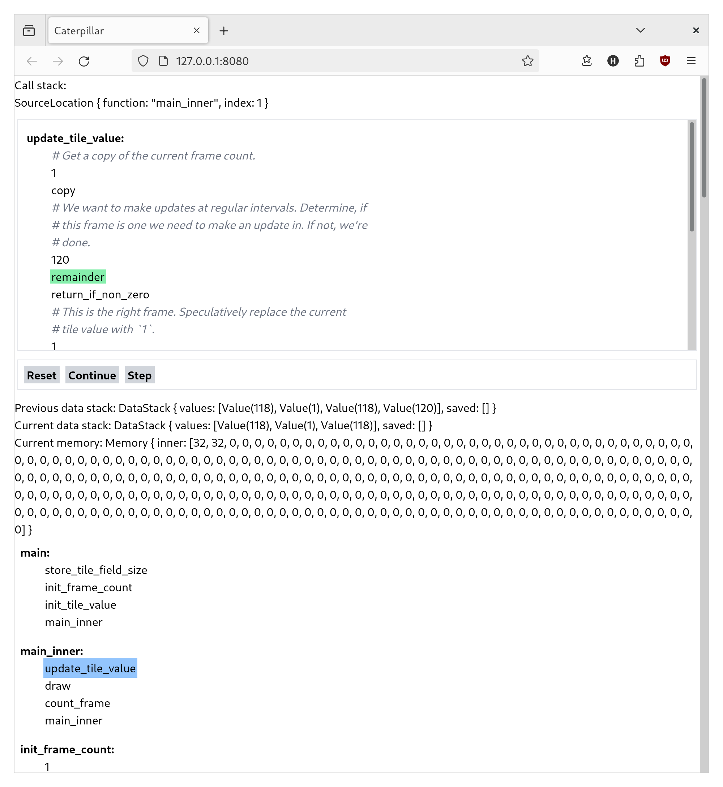

As I've explained before, the core question of the current prototype is, whether
a debugger is a practical option to tame even a simplistic and confusing
language. If that's the case, then I can use Caterpillar in earnest from early
on, while the language is growing slowly.

Early signs have been good, but the development of the prototype is still a bit
of a back and forth: I'll make some progress on the game, then I run into a
problem that takes too much effort to understand, so I improve the debugger
until understanding the problem becomes easy. I just went through another
debugger improvement phase, and here's how it looks right now:

It's a bit easier to see where you're currently at in the code, and there are
"Step" and "Continue" buttons to better control the program. I won't consider
this prototype successful (i.e. the core question answered) until I've made a
full game with it, but I continue to be happy with the progress.
